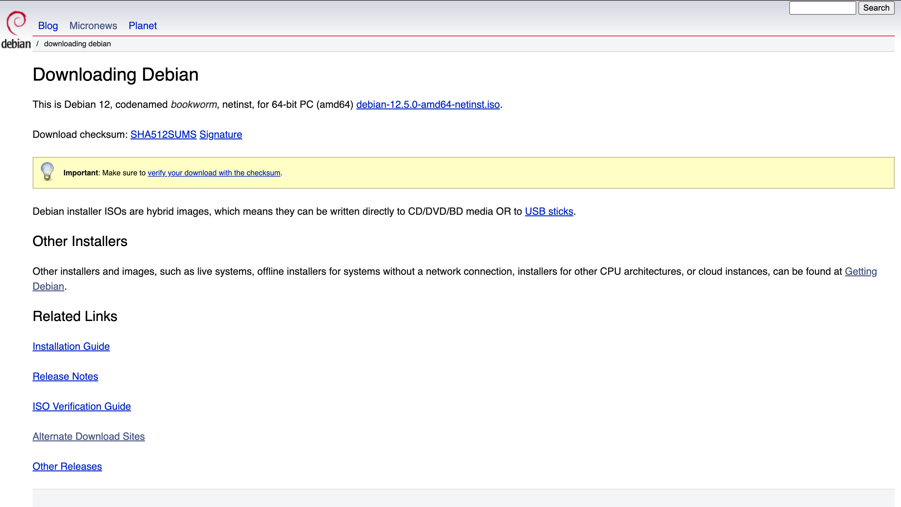
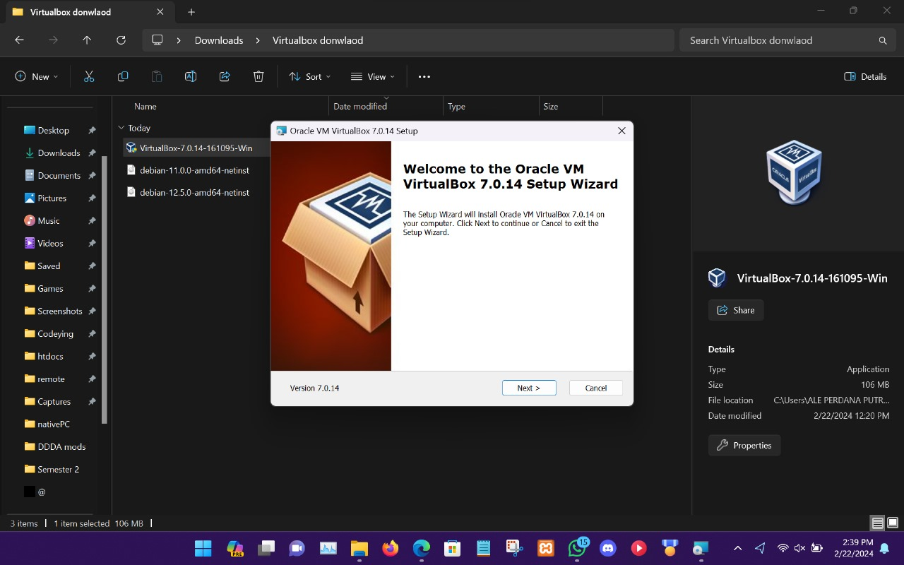
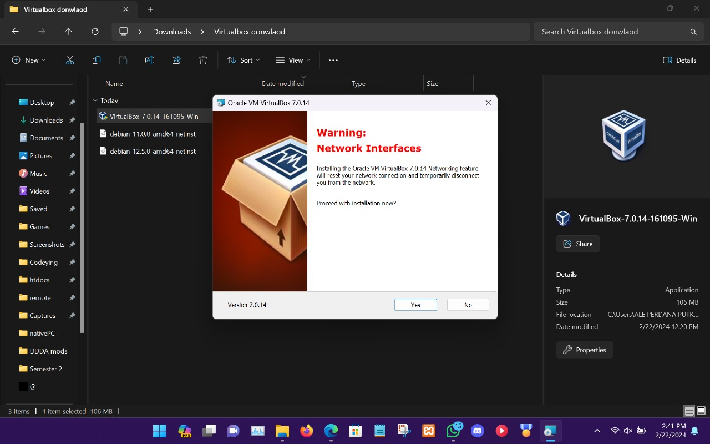
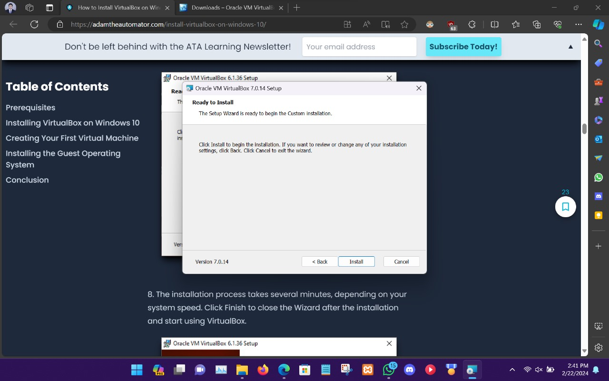
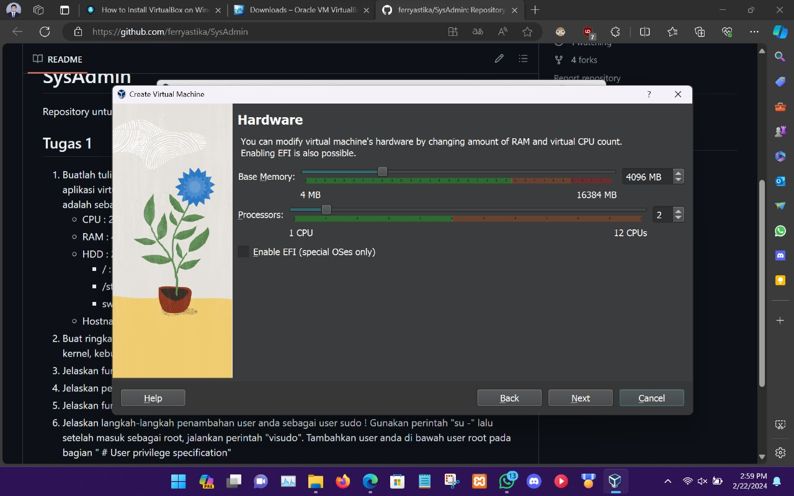
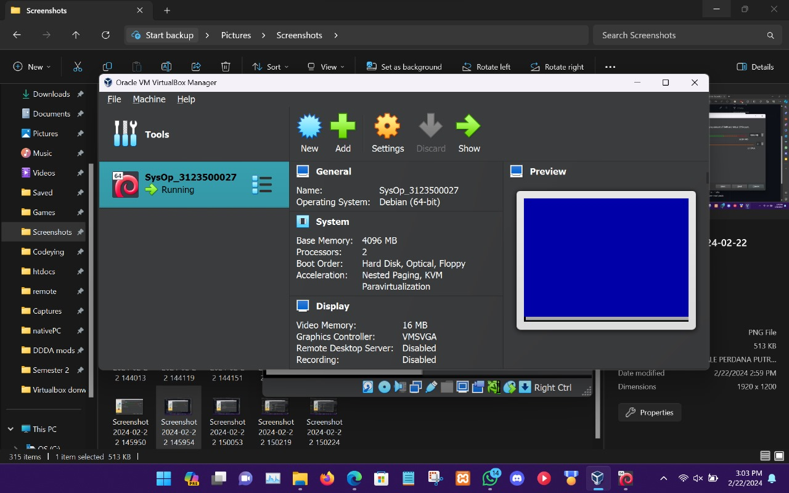
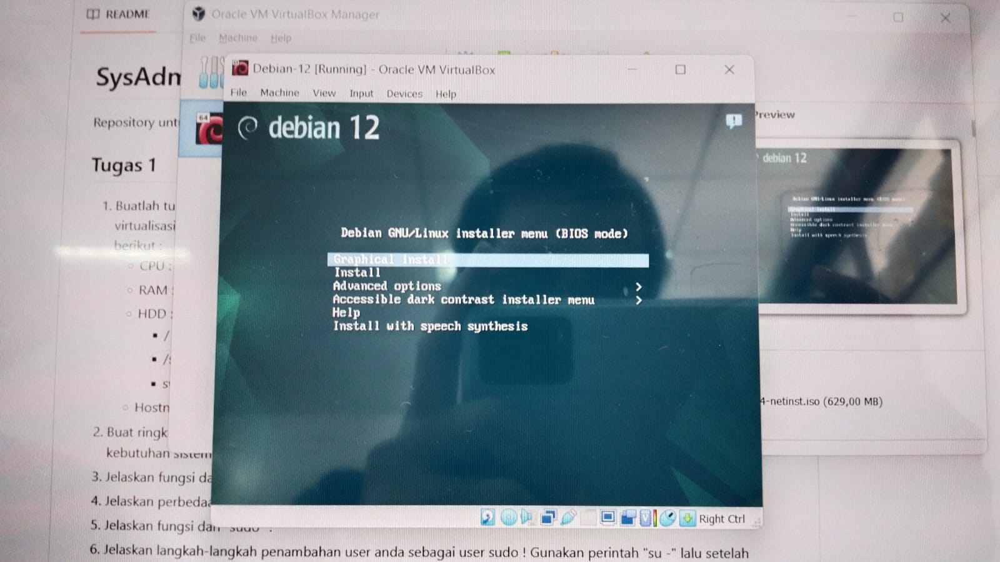

  <h1 style="text-align: center;font-weight: bold">PRAKTIKUM 1 SISTEM OPERASI</h1>
  <h4 style="text-align: center;">Dosen Pengampu : Dr. Ferry Astika Saputra, S.T., M.Sc.</h4>

 

  
  <h3 style="text-align: center;">Disusun Oleh : </h3>
  

    <strong>Marieta Nona Alfani (312350026) </strong> 
    <strong>Ale Perdana Putra Darmawan (3123500027) </strong> 
    <strong>Kanisius Keru Okok Dinggon(3123500028)</strong>
  

<h3 style="text-align: center;line-height: 1.5">Politeknik Elektronika Negeri Surabaya Departemen Teknik Informatika Dan Komputer Program Studi Teknik Informatika 2023/2024</h3>
  

## Daftar Isi
1. [Dasar Teori](#Dasar-teori)
2. [Soal](#soal)
3. [Instalasi Oracle Virtual Box](#Instalasi-Oracle-Virtual-Box)
4. [Mengkonfigurasi Debian dalam Oracle Virtual Box](#Mengkonfigurasi-Debian-dalam-Oracle-Virtual-Box)
5. [Instalasi Linux Debian dalam Oracle Virtual Box](#Instalasi-Linux-Debian-dalam-Oracle-Virtual-Box)

## Dasar teori
Pengertian Sistem Operasi: 
<strong>Sistem Operasi</strong> adalah perangkat lunak pada lapisan pertama yang ditempatkan pada memori komputer pada saat komputer dinyalakan booting. Sedangkan software-software lainnya dijalankan setelah sistem operasi berjalan, dan sistem operasi akan melakukan layanan inti untuk software-software itu.

## Soal
#### <h3> > Sebutkan dan jelaskan proses booting !</h3>
1. Pertama, kita menekan tombol Power komputer. Setelah komputer dihidupkan, keadaan memori masih kosong. Pada saat ini masih belum ada instruksi yang bisa dieksekusi oleh prosesor. Namun pengguna tidak perlu ikut memberi intruksi karena prosesor telah dirancang untuk mencari alamat tertentu di BIOS. Saat inilah prosesor menjalankan BIOS.

2. Kedua, BIOS mulai mengambil alih sebagai sistem operasi sementara komputer, lalu proses akan berlanjut dengan melakukan inspeksi terhadap semua kesalahan (penyebab variasi data) dalam memori, maupun Device-Device yang memang terhubung kepada komputer. Proses inilah yang sering dikenal dengan POST atau Power-On Self Test. Jika terdapat device yang bermasalah, proses tidak akan berlanjut. Tetapi memberi peringatan tentang masalah device tersebut.

3. ketiga, Proses dilanjutkan dengan BIOS mencari kartu grafis yang tertanam pada komputer dan berikutnya sistem BIOS menjalankan kartu grafis BIOS, serta pengecekan BIOS terhadap ROM.

4. Keempat, Setelah BIOS selesai melakukan pengecekan awal, BIOS akan mencari sistem operasi yang sudah diinstall lalu memuatnya pada memori serta segera menjalankannya. Kemudian, BIOS akan menjalankan sistem operasi tersebut. Jika sistem operasi mengalami error atau tidak ditemukan, BIOS akan menampilkan pesan kesalahan atau menu pilihan untuk masuk ke dalam visual BIOS.

5. Saat komputer telah diambil alih oleh sistem operasi, pengguna dapat mulai menjalankan berbagai program-program yang diinginkan.

#### Bagaimana cara install Oracle Virtual Box dan Debian dalam Virtual Box ?

## Instalasi Oracle Virtual Box
1. Masuk ke laman [Oracle Virtual box](https://www.virtualbox.org/wiki/Downloads), lalu unduh sesuai sistem operasi yang anda gunakan.
.jpeg)

2. Masuk ke laman Download sistem operasi [Debian](https://www.debian.org/download) untuk mengunduh sistem operasi Linux Debian.
   

3. Buka setup Oracle dan klik Next.
   

4. Dalam menu tidak ada yang perlu diubah, klik Next.
   

5. Klik Yes.
   

6. Klik Install.
   

7. Oracle Virtual Box telah di install, klik finish.
   

## Instalasi Linux Debian dalam Oracle Virtual Box
1. Buka Oracle Virtual Box, lalu klik opsi "New".

2. Isi nama, pilih letak penyimpanan Virtual Box, masukkan file ISO debian yang telah diunduh, klik "Skip unattended Installation, dan klik Next.
   

3. Isi Username dan hostname dan ubah password, untuk domain name tidak perlu diganti, lalu klik Next. 
   

4. Tentukan RAM dan jumlah CPU yang diinginkan, lalu klik Next.
   

5. Tentukan ukuran storage didalam Virtual Machine, lalu klik Next.
   

6. Dalam tampilan ini, anda dapat melihat ulang pilihan yang anda telah pilih sebelumnya, jika sudah sesuai keinginan, pilih Finish.
   

## Mengkonfigurasi Debian dalam Oracle Virtual Box
1. Klik "Start" untuk membuka Virtual Machine.

2. Pilih Graphical Install untuk memulai konfigurasi Debian.
   

3. Pilih Bahasa, lalu klik continue.
   

4. Pilih lokasi, lalu klik continue.
   

5. Pilih konfigurasi bahasa Keyboard, lalu klik continue.
   

6. Isi Hostname, lalu klik continue.
   

7. Untuk nama domain tidak perlu diisi, klik continue.
   

9. Isi root password, lalu klik continue.
   

10. Isi nama, lalu klik continue.
    

11. Isi username, lalu klik continue.
    

12. Pilih lokasi jam, lalu klik continue.
    

13. Untuk partition disk, pilih manual, lalu klik continue.
    

14. Pilih opsi seperti pada gambar dibawah, lalu klik continue.
    

15. Pilih "Yes" untuk membuat partition disk baru, lalu klik continue.
    

16. Pilih pri/log untuk membuat bagian partition disk, lalu klik continue.
    

17. Pilih "create new partition disk" untuk membuat partition disk, lalu klik continue.
    

18. Tentukan jumlah penyimpanan partition disk pertama, lalu klik continue.
    

19. Pilih "primary" agar menjadikan penyimpanan utama, lalu klik continue.
    

20. Pilih "beginning", lalu klik continue.
    

21. pilih opsi "done setting up the partition" klik continue.
    

22. Setelah membuat partition disk pertama, silahkan membuat partition disk ke dua, tentukan isi penyimpanan yang ukurannya lebih kecil dibandingkan partition disk pertama, lalu klik continue.
    

23. Untuk partition disk kedua, pilih opsi logical dan pada mount point pilih Enter manually dan ketik "/storage", lalu klik continue.
    

24. Setelah membuat partition disk kedua, silahkan membuat partition disk ke tiga, tentukan isi penyimpanan yang ukurannya lebih kecil dibandingkan partition disk kedua, lalu klik continue.
    

25. Untuk partition disk kedua, pilih opsi logical, lalu jadikan "swap area" pada bagian "use as:", lalu klik continue.
    

26. Cek ulang seperti gambar dibawah, jika sudah sesuai, klik continue.
    
    
28. Pilih opsi "Yes", lalu klik continue.
    

29. Pilih opsi "no", lalu klik continue.
    

30. Pilih lokasi terdekat untuk mengunduh package manager, lalu klik continue.
    

31. Pilih archive mirror, lalu klik continue.
    
    
33. Pada bagian ini tidak perlu diisi, klik continue
    

35. Pilih opsi "Yes", lalu klik continue.
    

37. Pilih opsi "/dev/sda", lalu klik continue.
    
    
39. Instalasi dan konfigurasi Debian telah selesai, klik continue dan Virtual machine akan me-reboot. 
    
    
41. Tampilan Linux Debian setelah reboot.
    
<!---
kanisiusdinggon/kanisiusdinggon is a ✨ special ✨ repository because its `README.md` (this file) appears on your GitHub profile.
You can click the Preview link to take a look at your changes.
--->
